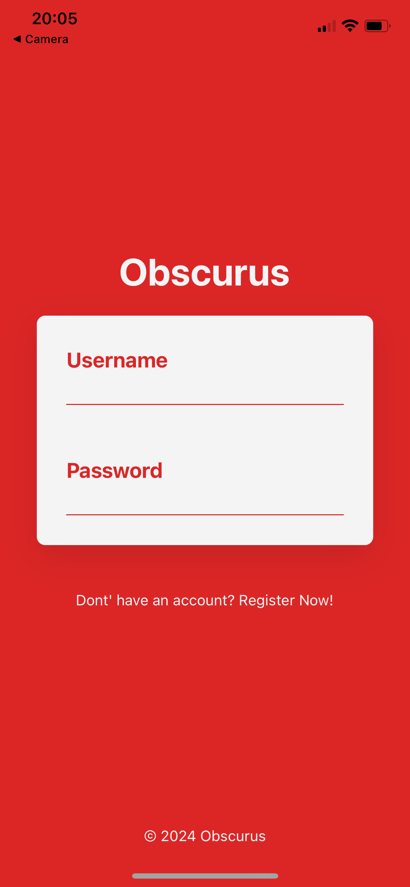
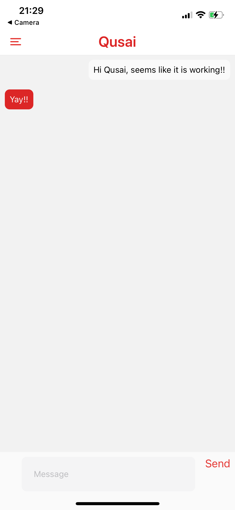

# Obscurus Chat app frontend

**Backend** repo can be found [here](https://github.com/Qabudhaim/chat-app-backend)

## Abstract
A chatting app with multiple functionalities, including user registration, login, and real-time messaging. The app was developed using Django Channels (WebSockets) and React Native, with a frontend styled in Tailwind. JWT was responsible for user authentication on the Django backend. 

## Tools and Frameworks
- Django channels ( WebSockets )
- Django Rest Framework ( RestAPI )
- React Native
- TailwindCSS

## Screenshots

